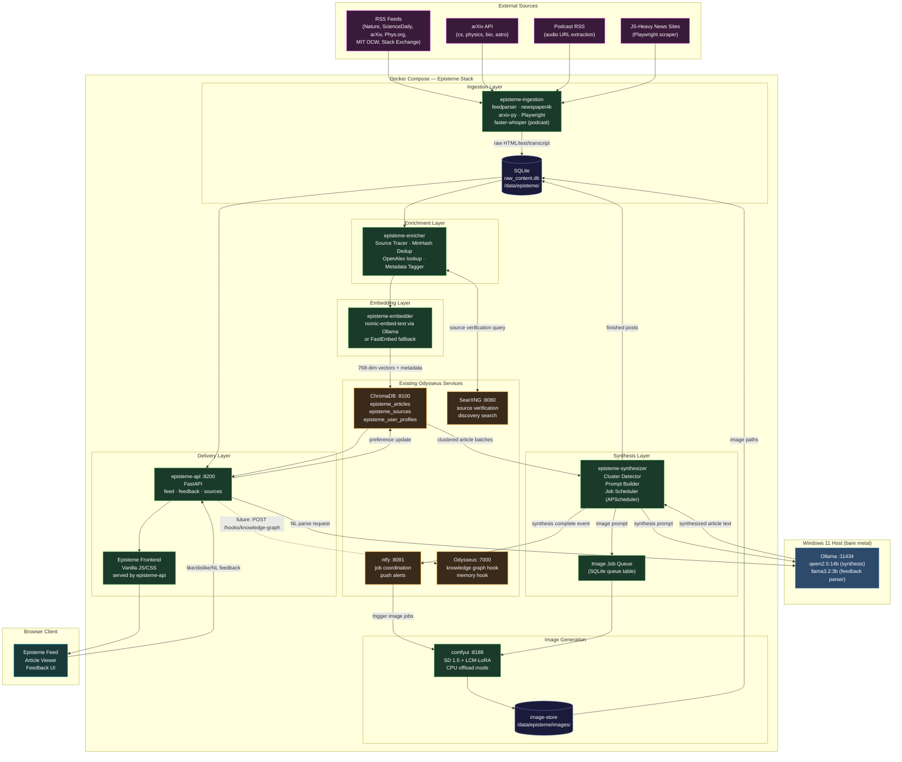

# Episteme — AI-Driven Personalized News Aggregator & Synthesizer

## Architectural Blueprint & Execution Plan v1.0

> **Naming note:** "Episteme" (ἐπίστημη, knowledge/science)

---

## Table of Contents

1. [System Architecture Diagram](#1-system-architecture-diagram)
2. [Docker vs. Host Distribution](#2-docker-vs-host-distribution)
3. [Component Deep Dives](#3-component-deep-dives)
   - 3.1 Ingestion & Source Discovery
   - 3.2 Enrichment Pipeline (Source Tracing, Dedup, Metadata)
   - 3.3 Vector Database & Embedding Strategy
   - 3.4 Synthesis Pipeline
   - 3.5 Image Generation Module
   - 3.6 Recommendation Engine & NL Feedback Loop
   - 3.7 Frontend
4. [Recommended Tech Stack](#4-recommended-tech-stack)
5. [Model Selections for Your Hardware](#5-model-selections-for-your-hardware)
6. [Implementation Phases](#6-implementation-phases)
7. [Odysseus Integration Hooks](#7-odysseus-integration-hooks)
8. [Bottlenecks & Mitigations](#8-bottlenecks--mitigations)

---

## 1. System Architecture Diagram



---

## 2. Docker vs. Host Distribution

| Component | Location | Reason |
|---|---|---|
| **Ollama** | Host (bare metal) | Already running; GPU access without passthrough complexity on Windows |
| **episteme-ingestion** | Docker | Network isolation; easy restart; schedule via APScheduler inside container |
| **episteme-enricher** | Docker | Shares `raw_content.db` volume with ingestion |
| **episteme-embedder** | Docker | Calls Ollama via `host.docker.internal:11434` |
| **episteme-synthesizer** | Docker | Orchestrates LLM calls via `host.docker.internal:11434` |
| **episteme-api** | Docker | FastAPI server; bridges all Episteme components |
| **comfyui** | Docker | Isolated; CPU offload configured via `--cpu` flag; port `8188` |
| **ChromaDB** | Docker (existing) | Add new collections; no schema change needed |
| **SearXNG** | Docker (existing) | Reused for source verification queries |
| **ntfy** | Docker (existing) | Job coordination events between synthesizer and ComfyUI |
| **SQLite raw_content.db** | Docker volume | Bind-mounted at `/data/episteme/` for easy host access |

---

## 3. Component Deep Dives

### 3.1 Ingestion & Source Discovery

**Purpose:** Pull raw content from all source types, normalize it, and store it in a staging database before enrichment.

#### Source Priority Matrix

| Source Type | Library | Update Cadence | Authority Weight |
|---|---|---|---|
| arXiv (cs, physics, bio, astro) | `arxiv` Python package | Every 6 hours | 1.0 (primary) |
| Nature News | `feedparser` | Every 2 hours | 0.9 |
| ScienceDaily, Phys.org | `feedparser` | Every 2 hours | 0.7 |
| MIT OpenCourseWare | `feedparser` (per dept.) | Daily | 0.8 |
| Wikipedia Featured/DYK | `feedparser` | Daily | 0.6 |
| Stack Exchange (science tags) | `feedparser` | Every 4 hours | 0.5 |
| Podcast audio | `feedparser` + `faster-whisper` | Daily | 0.7 |
| JS-heavy news sites | `playwright` (headless) | Every 4 hours | 0.4–0.8 |

#### Podcast Transcription Pipeline

`faster-whisper` (CPU-optimized quantized Whisper) is the correct tool here.
With 96 GB RAM, it uses the `large-v3` model on CPU at ~12–15× real-time speed
(a 1-hour podcast transcribes in ~4–5 minutes). Chunks are split at sentence
boundaries into ≤1000-token segments with 100-token overlap.

```
podcast RSS → audio URL → download to temp file → faster-whisper transcribe
→ split into chunks → each chunk = one "article" document in pipeline
→ tag with: source=podcast, episode_title, timestamp_range, speaker_diarization
```

#### Raw Content Schema (SQLite)

```sql
CREATE TABLE raw_content (
    id          TEXT PRIMARY KEY,  -- SHA-256 of canonical URL
    url         TEXT NOT NULL,
    canonical_url TEXT,
    title       TEXT,
    body_text   TEXT,
    published_at DATETIME,
    source_domain TEXT,
    source_type TEXT,              -- rss|arxiv|podcast|scrape
    doi         TEXT,
    arxiv_id    TEXT,
    processing_state TEXT DEFAULT 'raw',  -- raw|enriched|embedded|synthesized|done
    created_at  DATETIME DEFAULT CURRENT_TIMESTAMP
);

CREATE TABLE synthesized_posts (
    id           TEXT PRIMARY KEY,
    title        TEXT,
    body_html    TEXT,
    summary      TEXT,
    image_path   TEXT,
    topics       TEXT,             -- JSON array
    source_ids   TEXT,             -- JSON array of raw_content.id
    primary_sources TEXT,          -- JSON array of {doi, url, title}
    secondary_sources TEXT,        -- JSON array
    created_at   DATETIME DEFAULT CURRENT_TIMESTAMP,
    score        REAL DEFAULT 0.0
);
```

---

### 3.2 Enrichment Pipeline

**Purpose:** Source tracing, near-duplicate detection, metadata tagging. This runs
after ingestion and before embedding.

#### Source Tracing Algorithm

The goal is to find the original peer-reviewed paper behind a secondary news article.

```
Input: raw article text

Step 1 — Pattern extraction
  - Regex for DOIs:    r'\b10\.\d{4,9}/[-._;()/:A-Z0-9]+\b'
  - Regex for arXiv:   r'\barXiv:\s*(\d{4}\.\d{4,5})\b'
  - Quoted titles:     extract phrases in quotes ≥ 4 words as candidate paper titles

Step 2 — OpenAlex resolution (free, no API key for basic use)
  - For each DOI: GET https://api.openalex.org/works/https://doi.org/{doi}
  - Returns: full citation, abstract, cited_by_count, authors, institution, journal
  - Extract authority metrics: citation_count, journal_impact

Step 3 — SearXNG verification
  - For each candidate title: searxng query "site:arxiv.org OR site:pubmed.ncbi.nlm.nih.gov {title}"
  - Match top result against article content

Step 4 — Store results
  - primary_sources: [{doi, arxiv_id, title, citation_count, journal}]
  - secondary_sources: [{url, domain, title}]  ← the news article itself
```

#### Near-Duplicate Detection

Two-stage approach to balance speed and accuracy:

```
Stage 1 (fast, hash) — on URL ingestion:
  - SHA-256 of canonical URL → exact duplicate → skip

Stage 2 (near-duplicate, content) — after text extraction:
  - MinHash with 128 permutations, LSH with b=8 bands, r=16 rows
  - Similarity threshold: Jaccard > 0.85 → mark as duplicate of earlier article
  - Library: datasketch (pure Python, fast)

Stage 3 (semantic, post-embedding) — in ChromaDB query:
  - On each new embedding, query top-5 nearest neighbors
  - If cosine similarity > 0.93 → flag as semantic duplicate
  - Keep the one with higher authority score
```

#### Metadata Taxonomy

```json
{
  "topics": ["space", "biology", "archaeology", "computer_science", "climate",
             "physics", "chemistry", "paleontology", "neuroscience", "history"],
  "content_type": ["primary_research", "review", "news", "commentary",
                   "educational", "podcast", "speculation"],
  "complexity": "surface|moderate|technical",
  "authority_score": 0.0–1.0,
  "confidence": 0.0–1.0
}
```

Topic classification uses a zero-shot prompt to `llama3.2:3b` (fast, small):

```
"Classify this article into 1-3 topics from [taxonomy list]. Return JSON only."
```

---

### 3.3 Vector Database & Embedding Strategy

**Reuse existing ChromaDB instance.** Add three new named collections:

#### Collections

```python
# Collection 1: Article embeddings
episteme_articles = chroma.get_or_create_collection(
    name="episteme_articles",
    metadata={"hnsw:space": "cosine"}
)
# Documents: synthesized_posts (body text)
# Embeddings: 768-dim (nomic-embed-text) or 384-dim (all-MiniLM-L6-v2)
# Metadata: {topic, source_type, published_at, authority_score, post_id, doi}

# Collection 2: Source authority registry
episteme_sources = chroma.get_or_create_collection(
    name="episteme_sources",
    metadata={"hnsw:space": "cosine"}
)
# Documents: abstract or description of each primary source
# Metadata: {doi, arxiv_id, citation_count, journal, domain}

# Collection 3: User preference profiles
episteme_user_profiles = chroma.get_or_create_collection(
    name="episteme_user_profiles",
    metadata={"hnsw:space": "cosine"}
)
# One document per user: their preference embedding vector + filter state
# Updated in-place on every interaction
```

#### Embedding Model Decision

| Model | Dims | VRAM | Quality | Recommendation |
|---|---|---|---|---|
| `nomic-embed-text` via Ollama | 768 | ~0 (CPU) | Good | **Primary choice** |
| `all-MiniLM-L6-v2` (FastEmbed) | 384 | 0 (CPU) | Adequate | Fallback if Ollama busy |
| `mxbai-embed-large` via Ollama | 1024 | ~0 (CPU) | Best | Use if quality is paramount |

**Recommendation:** `nomic-embed-text` is already available via Ollama and produces
768-dim vectors that capture semantic nuance well for scientific content. Embedding
is CPU-bound and does not compete with LLM VRAM.

#### Clustering for Synthesis

Before synthesis, the pipeline groups related raw articles into clusters
so the LLM synthesizes a coherent post from multiple angles rather than one source:

```python
# Fetch latest unprocessed embeddings from ChromaDB
# Use HDBSCAN (min_cluster_size=2) on the embedding matrix
# Each cluster = one synthesis job
# Singleton clusters (unique stories) = single-source synthesis
```

---

### 3.4 Synthesis Pipeline

**Purpose:** Orchestrate LLM calls to produce a final, readable, cited article
from a cluster of source documents.

#### Two-Stage Hierarchical Synthesis

This is the key strategy for handling context window limits (see §8).

```
Stage 1 — Per-source summarization (llama3.2:3b, fast)
  Input:  raw article text (may be long)
  Prompt: "Summarize this article in 3-5 sentences preserving key facts,
           numbers, and named entities. Include any citations mentioned."
  Output: ~200-token summary per source
  → Reduces a 10-article cluster from ~20K tokens to ~2K tokens

Stage 2 — Synthesis (qwen2.5:14b, quality)
  Input:  all Stage 1 summaries + source metadata + user topic preferences
  Prompt: See synthesis prompt template below
  Output: Full synthesized article (600–1200 words) in HTML
  → Fits comfortably in context window
```

#### Synthesis Prompt Template

```
You are a science and technology journalist writing for an educated general audience.
You have been provided with summaries of {N} related articles on the topic of {cluster_topic}.

Your task:
1. Write a cohesive, engaging article (600–900 words) that synthesizes the key insights.
2. Prioritize primary research findings. Secondary sources provide context only.
3. Explain technical concepts clearly without dumbing them down.
4. Structure: [Hook paragraph] → [Core findings] → [Broader implications] → [Open questions]
5. Every factual claim must be traceable to a source summary.
6. End with a "Sources" section listing all primary sources with DOI/arXiv links.

Source summaries:
{summaries}

Source metadata (use for citations):
{source_metadata_json}

Output format: HTML with <h2>, <p>, <blockquote> (for direct quotes), and <footer> for sources.
Do NOT include <html>, <head>, or <body> tags.
```

#### Job Scheduling (APScheduler inside episteme-synthesizer)

```
Ingestion jobs:    every 2h (RSS/news), 6h (arXiv), daily (podcasts)
Enrichment jobs:   runs after each ingestion batch completes
Embedding jobs:    runs after enrichment batch completes
Synthesis jobs:    runs every 4h; processes clusters with ≥2 sources first
Image gen jobs:    triggered via ntfy event AFTER synthesis completes
                   → prevents VRAM contention with Ollama
Cleanup job:       daily; prune raw_content older than 30 days
```

---

### 3.5 Image Generation Module

#### Hardware Constraint Analysis

Your 10 GB VRAM is consumed by `qwen2.5:14b-q4_K_M` (~9.2 GB). Running
image generation simultaneously is not viable. The solution is **strict sequential
scheduling**:

```
1. Synthesizer writes finished article text to SQLite + sends ntfy event
   "episteme/synthesis_complete" with post_id
2. Ollama model is unloaded (Ollama auto-evicts after keep_alive timeout;
   set OLLAMA_KEEP_ALIVE=30s in environment so it releases VRAM quickly)
3. ntfy subscriber in episteme-synthesizer receives the event
4. Image job is submitted to ComfyUI API
5. ComfyUI generates image → saves to /data/episteme/images/{post_id}.png
6. Synthesizer updates SQLite with image_path
```

#### Image Model Recommendation

**SD 1.5 + LCM-LoRA in CPU offload mode** is the optimal choice for this pipeline:

| Model | VRAM needed | CPU-offload time | Quality |
|---|---|---|---|
| FLUX.1-schnell | ~12 GB | ~45s (8-step) | Excellent |
| SDXL-Turbo | ~6 GB | ~60s (4-step) | Good |
| **SD 1.5 + LCM-LoRA** | **~2 GB active** | **~25s (4-step)** | **Good enough** |
| SD 1.5 baseline | ~2 GB | ~90s (20-step) | Adequate |

With `--lowvram` or `--cpu` flag in ComfyUI, SD 1.5 + LCM-LoRA generates
in ~25 seconds using system RAM. At 96 GB RAM, this is trivial.

#### ComfyUI Prompt Strategy

Use the synthesized article title + primary topic for the image prompt:

```python
def build_image_prompt(article_title: str, topics: list[str]) -> str:
    style = "scientific illustration, detailed, clean background, educational diagram"
    subject_map = {
        "space": "deep space, nebula, spacecraft",
        "biology": "biological cell, microscopy, DNA helix",
        "archaeology": "ancient ruins, artifacts, excavation site",
        "computer_science": "circuit board, neural network visualization, abstract data",
        "physics": "particle collision, wave interference, quantum field",
    }
    subjects = ", ".join(subject_map.get(t, "") for t in topics if t in subject_map)
    return f"{subjects}, {style}, inspired by: {article_title[:80]}"
```

**Negative prompt (always):** `text, watermark, blurry, human faces, NSFW, photorealistic human`

#### docker-compose addition for ComfyUI

```yaml
comfyui:
  image: ghcr.io/ai-dock/comfyui:latest-cpu  # CPU variant, no CUDA dependency
  ports:
    - "127.0.0.1:8188:8188"
  volumes:
    - comfyui-models:/opt/ComfyUI/models
    - episteme-images:/data/episteme/images
  environment:
    - CLI_ARGS=--lowvram --preview-method none
  restart: unless-stopped
```

---

### 3.6 Recommendation Engine & NL Feedback Loop

#### User Preference Vector

Each user has a preference embedding vector `U` (same dimensionality as article
embeddings: 768 dims for nomic-embed-text) stored in `episteme_user_profiles`.

**Initialization:** `U = mean(embeddings of first 10 articles shown)`

**Update rules on explicit signals:**

```python
ALPHA = 0.08  # learning rate — conservative to prevent preference drift

def update_on_like(U: np.ndarray, article_vec: np.ndarray) -> np.ndarray:
    U_new = U + ALPHA * article_vec
    return U_new / np.linalg.norm(U_new)  # re-normalize to unit sphere

def update_on_dislike(U: np.ndarray, article_vec: np.ndarray) -> np.ndarray:
    U_new = U - ALPHA * article_vec
    return U_new / np.linalg.norm(U_new)
```

#### NL Feedback Processing

Natural language feedback is parsed by `llama3.2:3b` (fast inference, ~0.5–1s)
into a structured intent object:

**Extraction prompt:**

```
Extract user feed preferences from this feedback as compact JSON.

Taxonomy: biology, physics, space, cs, archaeology, climate, crypto, politics,
          entertainment, sports, speculation, academic_depth, surface_news

Feedback: "{feedback_text}"

Output (JSON only, no explanation):
{
  "topic_boosts": {"topic_name": delta},   // delta: -2.0 to +2.0
  "depth_shifts": {"topic_name": "more|less"},
  "block_keywords": ["word_or_phrase"],
  "block_source_types": ["speculation|tabloid|crypto"],
  "summary": "one line description of change"
}
```

**Example parse:**

```
Input:  "I like the depth of the biology breakdown, but stop showing me speculative crypto news"

Output: {
  "topic_boosts": {"biology": 0.8, "crypto": -2.0},
  "depth_shifts": {"biology": "more"},
  "block_keywords": [],
  "block_source_types": ["speculation"],
  "summary": "Boost biology depth, suppress crypto and speculation"
}
```

**Applying parsed preferences to the user vector:**

```python
def apply_nl_feedback(U: np.ndarray, parsed: dict, chroma_client) -> np.ndarray:
    # Retrieve topic centroid embeddings
    for topic, delta in parsed["topic_boosts"].items():
        results = chroma_client.query(
            collection="episteme_articles",
            query_texts=[topic],
            n_results=50,
            where={"topic": topic}
        )
        if results["embeddings"]:
            topic_centroid = np.mean(results["embeddings"][0], axis=0)
            topic_centroid = topic_centroid / np.linalg.norm(topic_centroid)
            U = U + (delta * 0.05) * topic_centroid

    return U / np.linalg.norm(U)
```

**Persistent preference state** stored alongside the user vector:

```json
{
  "user_id": "default",
  "topic_weights": {"biology": 1.8, "space": 1.5, "crypto": -2.0},
  "depth_prefs": {"biology": "technical", "space": "moderate"},
  "block_source_types": ["speculation"],
  "block_keywords": [],
  "interaction_count": 47,
  "last_updated": "2026-06-27T14:30:00Z"
}
```

#### Feed Ranking Formula

```python
import math
from datetime import datetime, timezone

def score_article(post: dict, U: np.ndarray, prefs: dict, now: datetime) -> float:
    # Hard block check
    blocked_types = set(prefs.get("block_source_types", []))
    if any(t in blocked_types for t in post["content_types"]):
        return -999.0
    blocked_kw = set(k.lower() for k in prefs.get("block_keywords", []))
    if any(kw in post["title"].lower() for kw in blocked_kw):
        return -999.0

    # Semantic similarity (0–1)
    article_vec = np.array(post["embedding"])
    semantic = float(np.dot(U, article_vec))  # both are unit vectors → cosine sim

    # Recency decay — half-life of 36 hours
    age_hours = (now - post["published_at"]).total_seconds() / 3600
    recency = math.exp(-math.log(2) * age_hours / 36)

    # Source authority (normalized 0–1 from OpenAlex citation count)
    authority = post.get("authority_score", 0.5)

    # Topic weight adjustment
    topic_adj = sum(
        prefs.get("topic_weights", {}).get(t, 0.0) * 0.05
        for t in post.get("topics", [])
    )

    # Weighted composite
    return (0.50 * semantic) + (0.25 * recency) + (0.25 * authority) + topic_adj
```

---

### 3.7 Frontend

#### Design Philosophy

The frontend should be a **distraction-free reading experience** — like a personalized
version of Quanta Magazine or Ars Technica's long-form section. No infinite scroll;
instead, a curated daily digest model with explicit navigation.

#### Layout Structure

```
┌─────────────────────────────────────────┐
│  HELIOS           [⚙ Preferences] [🔔]  │
├─────────────────────────────────────────┤
│  ┌──────────────────────────────────┐   │
│  │ [Illustration]  TODAY'S DIGEST   │   │
│  │                 "Quantum error   │   │
│  │                  correction..."  │   │
│  │ [Space][CS]  ▲ Like  ▼ Dislike  │   │
│  └──────────────────────────────────┘   │
│  ┌──────────────────────────────────┐   │
│  │  [img]  Article title...          │   │
│  │  Summary text · [Space]           │   │
│  └──────────────────────────────────┘   │
│  ┌──────────────────────────────────┐   │
│  │  "Tell me more / less about..."  │   │
│  │  [Natural language feedback box] │   │
│  └──────────────────────────────────┘   │
└─────────────────────────────────────────┘
```

#### Key Interactive Features

1. **Article modal:** Full synthesized article with source citations. Each citation
   is a clickable link to the original DOI/arXiv page. Primary sources distinguished
   from secondary visually.
2. **Like/Dislike buttons:** Immediate `POST /feed/{id}/signal` → optimistic UI update.
3. **NL feedback textarea:** On submit → `POST /feed/feedback` → shows parsed
   summary back to user: *"Got it — boosting biology depth, suppressing speculation."*
4. **Topic pill filters:** Clickable topic tags that act as hard filters for the
   current session. Stored in `localStorage`.
5. **Reading progress bar:** Thin progress indicator at top of article modal.
6. **Source provenance panel:** Expandable sidebar showing the full source chain
   (news article → press release → original paper → citation metrics).

#### Tech: Why Vanilla JS (not React/Vue)

- Matches the existing Odysseus frontend pattern (vanilla JS + Jinja2)
- Zero build toolchain overhead
- Fully serviceable by the LLM if you want Odysseus's agent to modify it
- Fast load time — no 200 KB framework bundles

---

## 4. Recommended Tech Stack

| Layer | Technology | Justification |
|---|---|---|
| **Ingestion** | `feedparser 6.x` | Battle-tested RSS/Atom parser |
| | `newspaper4k` | Modern fork of newspaper3k; better article extraction |
| | `arxiv` (official Python package) | Clean arXiv API wrapper |
| | `playwright` (Python) | JS-heavy sites only; run headlessly |
| | `faster-whisper` | Quantized Whisper for podcast transcription on CPU |
| **Source Tracing** | OpenAlex REST API | Free, no key needed for basic use; 200M+ works |
| | `doi` package | DOI resolution and normalization |
| **Deduplication** | `datasketch` | MinHash + LSH; pure Python, fast |
| **Backend** | Python 3.12 + FastAPI | Matches Odysseus stack exactly |
| | APScheduler 3.x | In-process job scheduler; no Redis dependency |
| | SQLite (via `aiosqlite`) | Zero-ops; sufficient for personal scale (<10M rows) |
| **Vector DB** | ChromaDB (existing) | Reuse; avoid operating a second vector store |
| **Embeddings** | `nomic-embed-text` via Ollama | Local, 768-dim, good semantic quality |
| **LLM Synthesis** | Ollama + qwen2.5:14b | See §5 |
| **LLM Fast Tasks** | Ollama + llama3.2:3b | Tagging, feedback parsing, summarization |
| **Image Gen** | ComfyUI + SD 1.5 + LCM-LoRA | CPU offload viable; no VRAM conflict |
| **Task Coordination** | ntfy (existing) | Lightweight pub/sub for job events |
| **Frontend** | Vanilla HTML/CSS/JS | Matches Odysseus; no build toolchain |
| **Python deps** | `httpx`, `aiofiles`, `pydantic v2` | Async HTTP; matches Odysseus patterns |

---

## 5. Model Selections for Your Hardware

**Hardware profile:** 10 GB VRAM · 96 GB RAM · Windows 11 · Ollama on host

### Primary Synthesis Model

**`qwen2.5:14b-instruct-q4_K_M`**

- VRAM: ~9.2 GB (just fits; leaves ~800 MB for KV cache)
- Context: 128K tokens
- Why: Qwen2.5 has industry-leading performance at long-form writing, report
  generation, and strict format following — exactly what synthesis needs.
  Benchmark leader on writing quality among sub-14B models.
- Pull: `ollama pull qwen2.5:14b-instruct-q4_K_M`

Fallback if VRAM proves tight: **`llama3.1:8b-instruct-q5_K_M`**

- VRAM: ~6.2 GB · Context: 128K · Strong instruction following · Leaves 4 GB free

### Fast Task Model (tagging, feedback parsing, per-source summaries)

**`llama3.2:3b-instruct-q8_0`**

- VRAM: ~3.4 GB (Ollama swaps it in/out automatically when primary model isn't loaded)
- Inference: ~30–50 tokens/sec on your GPU
- Use for: topic classification, NL feedback parsing, Stage 1 per-source summaries
- Pull: `ollama pull llama3.2:3b-instruct-q8_0`

### Embedding Model

**`nomic-embed-text`** via Ollama

- Runs on CPU (no VRAM usage)
- 768-dim output; good for semantic similarity in scientific text
- Pull: `ollama pull nomic-embed-text`

### Image Generation Model

**SD 1.5 + LCM-LoRA** loaded in ComfyUI

- In CPU offload mode: ~25s per 512×512 image with 4-step LCM sampling
- Model download (~1.1 GB for SD 1.5 base + ~68 MB for LCM-LoRA)
- Acceptable quality for contextual illustrations; not photorealistic, which is intentional

### Ollama Environment Configuration (add to Odysseus `.env`)

```
OLLAMA_KEEP_ALIVE=30s          # release VRAM 30s after last request → fast SD pickup
OLLAMA_MAX_LOADED_MODELS=1     # only one model in VRAM at a time
OLLAMA_NUM_PARALLEL=1          # one request at a time; prevents memory fragmentation
```

---

## 6. Implementation Phases

### Phase 1 — MVP (Weeks 1–3)

**Goal:** Working feed with LLM-synthesized articles from RSS + arXiv. No images, no recommendation yet.

- [ ] Add `episteme-ingestion` container to `docker-compose.yml`
  - `feedparser` for 10 initial RSS feeds
  - `arxiv` package for cs.AI, astro-ph.GA, q-bio.GN
  - Store to `raw_content.db`
- [ ] Add `episteme-api` container (FastAPI, port 8200)
  - `GET /feed` — returns latest 20 posts
  - `GET /feed/{id}` — returns full post HTML
  - `GET /health`
- [ ] Build `episteme-synthesizer` as a function called from `episteme-api`
  - APScheduler runs every 4 hours
  - Stage 1 summaries via `llama3.2:3b`
  - Stage 2 synthesis via `qwen2.5:14b`
  - Store to `synthesized_posts` table
- [ ] Minimal frontend: static HTML page served from `episteme-api`
  - Card grid of articles
  - Click → article modal with citations

**Deliverable:** You have a personal news feed auto-populated every 4 hours.

---

### Phase 2 — Enrichment + Images (Weeks 4–7)

**Goal:** Source tracing, near-duplicate filtering, image generation, and ChromaDB integration.

- [ ] Build `episteme-enricher`
  - OpenAlex DOI resolution
  - `datasketch` MinHash deduplication
  - Topic classifier (llama3.2:3b zero-shot)
  - Authority score normalization
- [ ] Integrate with ChromaDB
  - Embedding pipeline via `nomic-embed-text`
  - Three collections: articles, sources, user_profiles
- [ ] Add ComfyUI to `docker-compose.yml`
  - SD 1.5 + LCM-LoRA, CPU offload
  - ntfy subscriber triggers image jobs after synthesis
- [ ] Extend frontend
  - Image display in cards
  - Source provenance panel
  - Topic pill filters

**Deliverable:** Full pipeline with illustrated articles and source attribution.

---

### Phase 3 — Recommendation Intelligence (Weeks 8–12)

**Goal:** Like/Dislike signals, NL feedback, preference vector, ranked feed.

- [ ] Implement user preference vector in `episteme_user_profiles` ChromaDB collection
- [ ] `POST /feed/{id}/signal` — update user vector on like/dislike
- [ ] `POST /feed/feedback` — NL feedback → llama3.2:3b parse → apply to user vector
- [ ] `GET /feed` — ranked by scoring formula
- [ ] Podcast ingestion
  - faster-whisper transcription pipeline
  - Chunk embedding + storage
- [ ] Playwright scraper for 3–5 JS-heavy priority sources
- [ ] Add ntfy push alerts: "New Episteme digest ready" → Odysseus notification

**Deliverable:** Feed that improves with each interaction.

---

### Phase 4 — Odysseus Integration (Weeks 13+)

**Goal:** Bidirectional hooks between Episteme and Odysseus.

- [ ] `POST /hooks/knowledge-graph`
  - Episteme pushes synthesized article to Odysseus memory/notes
  - Article becomes a node in Odysseus's knowledge base
  - Requires: read `routes/memory_routes.py` and `routes/note_routes.py` to
    understand the existing write API
- [ ] `GET /hooks/context`
  - Episteme pulls user's active topics from Odysseus calendar (upcoming events →
    boost adjacent topics; e.g., calendar entry "exoplanet talk" → boost space)
  - Pulls from Odysseus task/note recency signals as soft topic hints
- [ ] Unified auth: Episteme checks Odysseus session token via shared `core/auth.py`
  so there's no second login
- [ ] Surface Episteme feed as a panel inside Odysseus's UI (iframe embed or
  dedicated Odysseus route `routes/episteme_routes.py`)

---

## 7. Odysseus Integration Hooks

### Integration Point Map

| Odysseus Route | Episteme Usage | Direction |
|---|---|---|
| `routes/memory_routes.py` | Push synthesized articles as memory entries | Episteme → Odysseus |
| `routes/note_routes.py` | Save user-flagged articles as notes | Episteme → Odysseus |
| `routes/task_routes.py` | Create "read later" tasks from bookmarked articles | Episteme → Odysseus |
| `routes/calendar_routes.py` | Pull upcoming events as topic hint signals | Odysseus → Episteme |
| `routes/research_routes.py` | Trigger Deep Research from Episteme article | Episteme → Odysseus |
| `routes/webhook_routes.py` | Receive Odysseus agent actions (e.g., "add source") | Odysseus → Episteme |
| `routes/embedding_routes.py` | Share embedding infrastructure | Both |

### Future Knowledge Graph Design (Phase 4+)

The personal knowledge graph will be a new ChromaDB collection `odysseus_kg`
(or a dedicated SQLite graph schema) with entity-relation triples:

```
Article → CITES → PrimarySource
Article → RELATED_TO → Note (user's personal note on same topic)
Article → INFORMS → Task (research task spawned from article)
User.Interest → WEIGHTS → Topic
CalendarEvent → BOOSTS → Topic (temporal relevance)
```

This enables queries like: *"Show me articles related to my notes from last week
on CRISPR, prioritized by my calendar's upcoming biotech conference."*

---

## 8. Bottlenecks & Mitigations

### Bottleneck 1: Context Window Exhaustion During Synthesis

**Problem:** A cluster of 8 news articles averages ~1,500 tokens each = 12,000 tokens
just for source content. Add system prompt (~500) and output reserve (~1,200) and
you're at 13,700 tokens — manageable with 128K models. But a cluster of 20 academic
papers with full abstracts easily exceeds 40,000 tokens. More importantly,
quality degrades with very long prompts as the model "loses track" of early content.

**Mitigation:**

- Hierarchical synthesis (Stage 1 → Stage 2) is the primary solution — see §3.4.
  Stage 2 input is bounded to ~2,000 tokens regardless of cluster size.
- Hard cap: maximum 12 source documents per synthesis job. If a cluster exceeds 12,
  split into sub-clusters by topic sub-facet and produce multiple posts.
- Article body truncation: strip boilerplate, navigation text, ads. `newspaper4k`
  does this; verify with a quick quality check on first run.

---

### Bottleneck 2: VRAM Contention (Ollama vs. Image Generation)

**Problem:** `qwen2.5:14b-q4_K_M` occupies ~9.2 GB of 10 GB VRAM. ComfyUI/SD needs
at minimum ~2 GB to load the UNet. They cannot run simultaneously.

**Mitigation (implemented in architecture):**

1. `OLLAMA_KEEP_ALIVE=30s` ensures the LLM evicts from VRAM quickly after synthesis.
2. Synthesis orchestrator sends ntfy event `episteme/synthesis_complete` only after
   the Ollama request returns and a 35-second buffer wait.
3. ComfyUI subscribes to that ntfy topic. Image jobs queue locally and process
   sequentially. No polling; event-driven.
4. ComfyUI is configured `--lowvram` as fallback, pushing SD model to system RAM
   if VRAM is somehow still occupied.

**Timeline impact:** A full synthesis cycle (10 articles → 1 post):

- Stage 1 summaries (llama3.2:3b): ~30s
- Stage 2 synthesis (qwen2.5:14b): ~90s
- Buffer: 35s
- Image generation (SD 1.5 CPU offload): ~25s
- **Total: ~3 minutes per post** — entirely acceptable for a background pipeline.

---

### Bottleneck 3: Rate Limiting on External Sources

**Problem:** arXiv, news sites, and OpenAlex will rate-limit aggressive scrapers.
Playwright is especially slow (3–5s per page).

**Mitigation:**

- arXiv: Use the official `arxiv` Python package which respects the API's 3s
  request delay. Batch queries by category, not per-paper.
- News sites: 2-second minimum delay between requests; random jitter ±1s.
  Use `feedparser` for RSS (lightweight HTTP, not headless browser) wherever possible.
  Reserve Playwright for only 3–5 sources that have no RSS alternative.
- OpenAlex: Free tier allows 100K requests/day with a polite `User-Agent` header.
  Cache all OpenAlex responses in SQLite. A DOI resolved once never needs resolving again.
- SearXNG: Self-hosted, no rate limit. Use freely for source verification.

---

### Bottleneck 4: Podcast Transcription Latency

**Problem:** A 2-hour podcast takes ~8–10 minutes to transcribe with faster-whisper
on CPU. This blocks the ingestion worker thread.

**Mitigation:**

- Run transcription in a separate process pool (Python `ProcessPoolExecutor`).
- Use `large-v3` model if accuracy is critical; `medium` model for ~2× speed with
  minimal quality loss for spoken non-technical content.
- Transcription is time-insensitive — run it as a low-priority background task,
  not in the main 2-hour ingestion cycle. Schedule it once daily at off-peak hours.
- Mark podcast episodes as `processing_state='transcription_queued'` and skip
  them in synthesis until transcription completes.

---

### Bottleneck 5: ChromaDB Metadata Filter Performance at Scale

**Problem:** As `episteme_articles` grows (estimate: ~5K articles/month),
metadata-filtered queries (e.g., "get all space articles from last 7 days") may slow.

**Mitigation:**

- ChromaDB's HNSW index is fast at ANN search but metadata filtering is post-hoc.
  For a personal aggregator, 60K articles/year is well within ChromaDB's comfortable range.
- Partition by time if needed: archive articles older than 90 days to a separate
  `episteme_articles_archive` collection. Active queries only hit the small recent collection.
- SQLite `synthesized_posts` table handles all non-vector queries (pagination, date
  range filtering, topic filtering by exact match). ChromaDB is used only for
  semantic similarity queries.

---

### Bottleneck 6: LLM Synthesis Quality for Technical Content

**Problem:** Consumer LLMs sometimes hallucinate citations, invent statistics,
or conflate two different studies in a synthesis.

**Mitigation:**

- **Grounding constraint in prompt:** *"Only state facts that appear verbatim in
  the source summaries provided. If a claim is uncertain, use hedging language."*
- **Post-synthesis citation check:** After generation, extract all citation markers
  from the output and verify each against the `source_metadata_json` input. Flag
  any citation not found in sources as a hallucination. Mark post `confidence=low`
  and surface a warning badge in the UI.
- **Temperature:** Set `temperature=0.3` for synthesis (lower than default for
  factual grounding), `temperature=0.7` for topic tagging and NL feedback parsing.

---

## Appendix A: docker-compose.yml Addition

Add the following services to your existing `c:\selfhosting\odysseus\docker-compose.yml`:

```yaml
  episteme-api:
    build:
      context: ./episteme
      dockerfile: Dockerfile
    ports:
      - "127.0.0.1:8200:8200"
    volumes:
      - episteme-data:/data/episteme
    environment:
      - CHROMADB_HOST=chromadb
      - CHROMADB_PORT=8000
      - OLLAMA_BASE_URL=http://host.docker.internal:11434
      - SEARXNG_URL=http://searxng:8080
      - NTFY_URL=http://ntfy:80
      - HELIOS_DATA=/data/episteme
    depends_on:
      - chromadb
      - searxng
      - ntfy
    extra_hosts:
      - "host.docker.internal:host-gateway"
    restart: unless-stopped

  comfyui:
    image: ghcr.io/ai-dock/comfyui:latest-cpu
    ports:
      - "127.0.0.1:8188:8188"
    volumes:
      - comfyui-models:/opt/ComfyUI/models
      - episteme-data:/data/episteme
    environment:
      - CLI_ARGS=--lowvram --preview-method none
    restart: unless-stopped

# Add to volumes section:
#   episteme-data:
#   comfyui-models:
```

---

## Appendix B: Initial RSS Feed List

```python
INITIAL_FEEDS = [
    # Science
    "https://www.nature.com/news.rss",
    "https://www.sciencedaily.com/rss/all.xml",
    "https://phys.org/rss-feed/",
    "https://feeds.arstechnica.com/arstechnica/science",
    "https://rss.sciam.com/ScientificAmerican-Global",
    # Space
    "https://www.nasa.gov/rss/dyn/breaking_news.rss",
    "https://www.space.com/feeds/all",
    "https://www.skyandtelescope.org/feed/",
    # CS / AI
    "https://feeds.arstechnica.com/arstechnica/technology-lab",
    "https://www.technologyreview.com/feed/",
    # Educational
    "https://ocw.mit.edu/rss/new/",
    "https://en.wikipedia.org/w/index.php?title=Special:RecentChanges&feed=rss",
    # Archaeology
    "https://www.archaeology.org/feed",
    "https://www.heritagedaily.com/feed",
]

ARXIV_CATEGORIES = [
    "cs.AI", "cs.LG", "astro-ph.GA", "astro-ph.EP",
    "q-bio.GN", "q-bio.NC", "physics.hist-ph", "cond-mat.str-el",
]
```

---

*Generated: 2026-06-27 | For Odysseus workspace | Hardware: 10GB VRAM / 96GB RAM / Windows 11*
