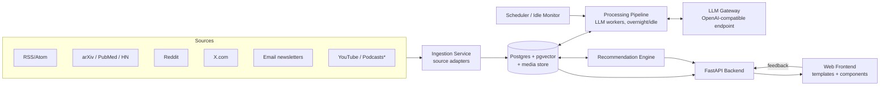

# Episteme — System Specification

A self-hosted, single-user system that ingests news from many sources, processes it
overnight with a local LLM, and produces a personalized, healthy, science- and
learning-focused newsfeed of newly written articles with interactive components.

---

## 1. Vision & Principles

**What it is:** a personal editor/researcher that reads the internet for you at night
and hands you a small, high-quality, finite feed of articles in the morning — written
for you, citing its sources, and designed to teach rather than to maximize engagement.

**Design principles**

1. **Healthy by construction** — the feed leads with a finite daily selection
   ("you're caught up"), balanced across topics, transparent about *why* an item
   appears, and always cites sources. Scrolling past the daily selection continues
   into clearly labeled lightweight aggregation — never disguised filler ranked for
   engagement.
2. **Local-first** — all processing on your machine. External calls are only for
   fetching content. The LLM runtime is swappable via an OpenAI-compatible API.
3. **Data ≠ presentation** — articles are stored as structured data; standardized
   HTML templates and shared CSS render them. Writing an article means producing
   simple data, never markup.
4. **Everything is a plugin** — sources, pipeline stages, article section types, and
   recommendation signals are all registered extensions behind small interfaces.
5. **Resumable and interruptible** — processing runs overnight/when idle and must
   survive being paused, killed, or resumed at any point.

---

## 2. System Overview



*\* = stretch goal*

Five long-lived concerns, each independently replaceable:

| Component | Responsibility |
|---|---|
| Ingestion | Pull raw content from sources, normalize, dedupe |
| Pipeline | Cluster, filter, synthesize, enrich, quality-gate — via local LLM |
| Recommendation | Score candidates against the interest profile, compose a healthy feed |
| Backend API | Serve feed/articles, record feedback, admin operations |
| Frontend | Render article data through templates; capture feedback |

---

## 3. Tech Stack

| Layer | Choice | Rationale |
|---|---|---|
| Backend | Python 3.12+, FastAPI | Best ecosystem for feeds, embeddings, LLM tooling |
| Database | Postgres + pgvector | One store for relational data *and* embeddings |
| Job queue | Procrastinate (Postgres-backed) | No extra broker; jobs survive restarts |
| LLM access | OpenAI-compatible HTTP client | Swap Ollama / llama.cpp / LM Studio / vLLM freely |
| Frontend | Jinja2 server-rendered HTML + htmx + Web Components for interactive sections | Matches the data/template split; minimal JS to maintain |
| Charts/diagrams | Vega-Lite + Mermaid, rendered client-side from specs | LLM emits a spec, never draws |
| Media | Hotlinked from source (remote URLs + attribution); no local caching for now to save storage | Caching can be added later behind the `MediaAsset` abstraction |
| Scraping | Playwright (headless Chromium) for sources without feeds/APIs (X.com, etc.) | Personal use; runs in the worker |
| Deployment | Docker Compose (backend, worker, frontend, Postgres); LLM runtime native on host for GPU | Reproducible; portable to a home server later |

The frontend deliberately avoids a SPA framework: articles are documents, htmx covers
feed interactions (feedback buttons, load-next), and each interactive section type is
a self-contained Web Component. If interactivity outgrows this, individual components
can be upgraded without a rewrite.

### Reference hardware & model baseline

- Host: RTX 3080 (10 GB VRAM), 96 GB DDR5-6400 dual channel.
- Runtime: llama.cpp (`llama-server`, OpenAI-compatible) — its `json_schema`
  constrained generation is what makes the schema-validated section output (§6)
  reliable on local models.
- Baseline `writer` model: Qwen3.6-35B-A3B (Q4_K_M, MTP, KV cache quant q5/q4) —
  MoE with small active parameter count, so experts offload to system RAM while
  attention stays on GPU. Works decently but **not yet rigorously tested**; Phase 2
  includes benchmarking it (and candidates for the `fast` and `embed` roles) on real
  pipeline tasks: structured-output validity rate, claim faithfulness in `verify`,
  tokens/s overnight throughput.
- Model roles stay config-mapped (§7), so none of this is load-bearing for the code.

---

## 4. Data Model (core entities)

```
Source          — id, type (rss|arxiv|reddit|x|email|...), config JSON, schedule,
                  enabled, credibility_rating
SourceItem      — id, source_id, url, title, author, published_at, raw_content,
                  extracted_text, media_refs JSON, embedding, hash (dedupe),
                  doi?, arxiv_id?, fetch_status
PaperRef        — traced primary source: doi/arxiv_id, title, authors, journal,
                  citation_count, resolved via OpenAlex (cached); linked to Stories
Story           — id, cluster of related SourceItems (same underlying event/paper),
                  topic tags, embedding centroid,
                  status (new|written|aggregated|skipped)
Article         — id, story_id, title, slug, summary, sections JSON (see §6),
                  topics[], reading_time, difficulty, generated_at, model_used,
                  quality_score, status (draft|published|archived)
MediaAsset      — id, article_id?, source_item_id?, kind (image|video-embed|chart-spec),
                  remote_url, attribution, last_verified_at,
                  cached_path (nullable — unused for now; enables opt-in caching later)
Feedback        — id, article_id?, kind (like|dislike|more_topic|less_topic|
                  hide_source|save|report_error|nl_feedback), nl_text?,
                  parsed_intent JSON?, created_at
ReadEvent       — article_id, opened_at, dwell_seconds, scroll_depth,
                  interactions JSON (quiz answered, chart explored, ...)
InterestProfile — singleton; topic weights, source weights, embedding centroids
                  (liked/disliked), difficulty preference, hard blocks
                  (keywords, source types), updated_at
JobRun          — pipeline bookkeeping: stage, story_id, status, attempts, error, cost
```

The system is single-user by design — no accounts, no `user_id` columns, no auth in
the data model. This keeps every query and every table simpler.

---

## 5. Ingestion

**Adapter interface** — each source type implements:

```python
class SourceAdapter(Protocol):
    type_name: str
    def fetch(self, source: Source, since: datetime) -> list[RawItem]: ...
    def extract(self, item: RawItem) -> ExtractedItem: ...   # full text + media refs
```

Adapters are registered via entry points / a registry dict — adding a source type is
one new module, zero core changes.

**Planned adapters**

| Adapter | Notes |
|---|---|
| RSS/Atom | `feedparser`; covers most outlets, journals, blogs |
| Full-article fetch | Follows feed links, readability-style extraction (`trafilatura`) |
| arXiv / PubMed / HN | Official APIs, rich metadata |
| Reddit | API (or RSS fallback per subreddit) |
| X.com | Playwright-based scraping of accounts/lists (personal use); isolated behind the adapter interface |
| Playwright generic | Reusable headless-browser fetcher for any site without a feed/API; site-specific extraction configs |
| Email newsletters | IMAP mailbox polling of a dedicated address; HTML → text |
| YouTube (stretch) | Transcript ingestion via captions |
| Podcasts (stretch) | RSS enclosure + local Whisper transcription |

**Normalization:** everything becomes a `SourceItem` with extracted text, media
references, and an embedding (computed by a small local embedding model through the
same LLM gateway).

**Deduplication (three stages, cheap → expensive):**

1. Exact: SHA-256 of canonical URL.
2. Near-duplicate text: MinHash + LSH (`datasketch`), Jaccard > ~0.85.
3. Semantic: nearest-neighbor check on the new embedding (cosine > ~0.93) — keep
   the higher-authority item, link the rest into the same Story.

**Science source tracing** (what makes this a *science* feed, not just a news feed):
for each item, extract DOI / arXiv-ID patterns and quoted paper titles from the text,
resolve them against the free OpenAlex API (responses cached forever — a DOI resolved
once never needs resolving again). This attaches the *primary literature* behind a
news story: citation counts, journal, authors. Used for:

- distinguishing **primary sources** (the paper) from **secondary sources** (the
  news article) in the article's `sources` and `go_deeper` sections;
- an authority signal for triage and feed scoring;
- clustering — two news items citing the same DOI are the same Story.

Ingestion is cheap and runs on its own schedule (e.g., every 1–2 h) — it does **not**
wait for idle time. Only LLM processing is deferred to idle/overnight windows.

---

## 6. Article Format & Template System

The core of your "data vs. formatting" split. An `Article` is a **typed list of
sections**; the LLM only ever writes this data. The frontend owns one Jinja2 template
per section type plus shared CSS — so every article looks consistent, and improving
the design never touches article data.

```json
{
  "title": "Base editing reaches its first human trials",
  "summary": "One-paragraph hook...",
  "topics": ["genetics", "medicine"],
  "difficulty": "intermediate",
  "sections": [
    {"type": "prose",     "text": "markdown-formatted body text..."},
    {"type": "key_points","items": ["...", "..."]},
    {"type": "image",     "asset_id": 42, "caption": "...", "attribution": "..."},
    {"type": "chart",     "spec": {"$schema": "vega-lite", "...": "..."}},
    {"type": "diagram",   "mermaid": "flowchart LR; A-->B"},
    {"type": "video",     "embed_url": "https://youtube.com/...", "caption": "..."},
    {"type": "quiz",      "question": "...", "choices": ["..."], "answer": 1,
                          "explanation": "..."},
    {"type": "glossary",  "terms": [{"term": "...", "definition": "..."}]},
    {"type": "timeline",  "events": [{"date": "...", "label": "..."}]},
    {"type": "go_deeper", "links": [{"title": "...", "url": "...", "kind": "paper"}]},
    {"type": "sources",   "items": [{"title": "...", "url": "...", "outlet": "..."}]}
  ]
}
```

Rules:

- Every section type has a **JSON Schema**. LLM output is validated against it;
  invalid sections are retried or dropped — malformed data can never reach the
  renderer.
- `sources` is **mandatory** — every article links what it was written from.
- Interactive types (`quiz`, `chart`, `timeline`, `diagram`) are Web Components
  hydrated from the JSON; prose stays server-rendered HTML.
- Images/video are **hotlinked, not cached** — the `image` template must degrade
  gracefully (caption + source link shown when the remote image is gone). Link rot
  is accepted; opt-in caching can be added later via `MediaAsset.cached_path`.
- **Adding a section type** = JSON Schema + Jinja2 partial (+ optional Web Component)
  + a line in the writer prompt. Nothing else changes.

---

## 7. Processing Pipeline (overnight / idle)

A chain of composable stages; each stage is a Procrastinate job, checkpointed in
`JobRun`, so the pipeline can stop mid-run and resume where it left off.

```
1. cluster    — group new SourceItems into Stories (embedding similarity + time window)
2. triage     — small/fast model scores each Story: relevance to profile, science/
                learning value, credibility signals → write | aggregate | skip
                (write = full article generation; aggregate = surface directly in
                the feed as a Google-News-style cluster card, near-zero LLM cost)
3. research   — hierarchical context assembly: the `fast` model condenses each
                source item to a ~200-token summary preserving facts, numbers, and
                named entities, so the writer's input stays bounded (~2K tokens)
                no matter how large the cluster is. Hard cap ~12 sources per story
                (larger clusters split by sub-facet). Related past articles and
                traced PaperRefs included as metadata.
4. write      — main model produces the Article section data (structured output,
                schema-validated), synthesizing across sources, noting disagreement
                and uncertainty explicitly
5. enrich     — generate quiz, glossary, chart specs where the content supports them;
                select/caption source media
6. verify     — runs on EVERY written article: claims traced back to source text;
                hallucinated or unsupported claims flagged → fix or demote
                quality_score
7. publish    — quality gate (score threshold), else mark draft for manual review
```

**LLM Gateway** (single module all stages go through):

- Talks to any OpenAI-compatible endpoint; base URL + model names in config.
- **Model roles, not model names**, in code: `embed`, `fast` (triage/extraction),
  `writer` (article generation) — each role maps to a configured model, so upgrading
  a model is a config change.
- Enforces structured output (JSON Schema), retries with repair prompts, logs
  tokens/latency per job for visibility.

**Scheduling & idle behavior**

- A lightweight host-side agent (native Windows, outside Docker) watches user idle
  time and GPU usage; it flips a `processing_allowed` flag via the backend API.
- Workers poll the flag between jobs: overnight window (configurable, e.g. 01:00–07:00)
  always allowed; daytime allowed after N minutes idle; any user activity pauses
  after the current job finishes (jobs are sized to minutes, not hours).
- **Jobs are batched by model role** (all triage, then all research summaries, then
  all writing) so the GPU loads each model once per night instead of thrashing
  between `fast` and `writer` on every story.
- Morning target: pipeline drains the night's stories into a fresh feed.

---

## 8. Recommendation & Feedback

**Signals**

- *Explicit:* like/dislike, "more/less of this topic", hide source, save, report error.
- *Natural-language feedback:* a free-text box ("less speculative AI hype, more
  deep-sea biology") parsed by the `fast` model into a structured intent — topic
  boosts/suppressions, depth shifts, keyword/source-type blocks — applied to the
  profile, with the interpretation echoed back for confirmation ("Got it — boosting
  biology, suppressing speculation"). The most expressive feedback channel, and
  cheap to build since the structured-output machinery already exists.
- *Implicit (gentle):* opened, dwell time, scroll depth, quiz interaction. Implicit
  signals get low weight — this system optimizes learning value, not engagement.

**Profile:** topic weights + liked/disliked embedding centroids + source weights +
preferred difficulty + hard blocks (keywords, source types), updated incrementally
from feedback with a conservative learning rate and time decay (old interests fade
unless reinforced, single interactions can't yank the profile around).

**Scoring:** hard blocks filter first; then candidates scored by
`similarity to liked-centroid − similarity to disliked-centroid + topic weight +
source/paper authority (OpenAlex-informed) + freshness (half-life ~36 h)`.

**Healthy feed composition** — ranking alone is not the feed. The feed has two
tiers:

*Tier 1 — the daily selection (generated articles):*

- **Finite:** N generated articles per day (configurable, e.g. 10–15), then a
  visible "you're caught up" divider.
- **Diversity quota:** no topic exceeds ~30 % of the selection regardless of scores.
- **Serendipity slots:** 1–2 items per day from adjacent/unexplored topics.
- **Depth mix:** quick reads + one long-form deep dive.

*Tier 2 — the aggregation stream (below the divider):*

- Infinite scroll over `aggregate`-triaged Stories: Google-News-style cluster cards
  (best headline, snippet, outlet list, links out to originals). No LLM writing —
  effectively free content, so the feed never runs dry.
- Ranked by the same scorer + freshness; clearly styled as a distinct, lighter tier.
- Feedback on aggregation cards feeds the profile too — and can promote a story to
  `write` ("write me a full article on this") for the next processing window.

*Both tiers:*

- **Transparency:** every card shows *why* it's here ("you liked 3 genetics articles",
  "serendipity pick"); the explanation itself is tappable feedback.
- **No dark patterns:** no unread badges, no streaks, no pull-to-refresh dopamine.
  The infinite tier is honest filler below an honest divider, not a disguised
  extension of the curated feed.

The recommender is also a plugin surface: scoring signals implement a common
`Scorer` interface and are combined by configurable weights, so new signals (e.g.,
spaced-repetition of past quiz topics) can be added independently.

---

## 9. Web Frontend

- **Feed view:** the day's composed selection as cards (title, summary, topics,
  reading time, "why am I seeing this"), then the "caught up" divider, then the
  infinite aggregation stream (htmx lazy-loading pages of cluster cards). Plus
  history/search and saved articles.
- **Article view:** section data rendered through the template library (§6).
- **Feedback controls** on cards and at article end; htmx posts, no page reloads.
- **Library:** archive with full-text search (Postgres FTS) and topic browsing.
- **Admin panel:** manage sources, watch pipeline/job status, review drafts that
  failed the quality gate, tune feed-composition knobs, view LLM usage stats.
- Served on the LAN; no auth beyond network boundary initially (single user), but
  behind a reverse-proxy-ready design so auth can be added at the proxy later.

---

## 10. Deployment (Docker Compose)

```
services:
  db:        postgres:16 + pgvector          (volume: pgdata)
  backend:   FastAPI app (API + server-rendered frontend)
  worker:    same image, Procrastinate worker entrypoint (ingestion + pipeline)
  # LLM runtime (llama-server) runs natively on the host for GPU access;
  # containers reach it at host.docker.internal:<port>
volumes:  pgdata
```

The worker image includes Playwright + headless Chromium (for scraper adapters).
No media volume — media is hotlinked, and chart/diagram specs live in the DB.

- **Fully standalone** — no coupling to other self-hosted stacks (Odysseus etc.);
  Episteme runs its own Compose project with its own data stores.
- One repo, one Python package, two entrypoints (web, worker) — small surface to
  maintain.
- Host-side idle agent installed separately (tiny Python script + Task Scheduler).
- Config via `.env` + a `config.yaml` (sources, model roles, schedules, feed knobs).
- Backups: nightly `pg_dump` + media volume copy to a location of your choice.

---

## 11. Extensibility Map

| Want to add... | Touch |
|---|---|
| A new news source type | One adapter module |
| A new interactive section | JSON Schema + template partial (+ Web Component) + writer-prompt line |
| A new pipeline stage | One job module inserted into the stage chain |
| A new recommendation signal | One `Scorer` implementation + weight in config |
| A different/better LLM | Config change (model role mapping) |
| Local image generation (stretch) | New `enrich`-stage plugin emitting `image` sections via a diffusion endpoint |

---

## 12. Roadmap

**Phase 1 — Skeleton (read raw, no LLM writing yet)**
Compose setup, data model, RSS + full-article adapters, ingestion loop, minimal feed
UI showing extracted source items. *Proves ingestion + UI plumbing.*

**Phase 2 — The writer**
LLM gateway, clustering, triage (write/aggregate/skip), aggregation cluster cards
with infinite scroll, article writing with `prose`/`key_points`/`sources` sections,
schema validation, article view. *First generated morning feed — with the
aggregation tier as fallback so the feed is useful even on light processing nights.*

**Phase 3 — Personalization & health**
Feedback capture, interest profile, scoring, healthy feed composition, "why am I
seeing this", natural-language feedback box.

**Phase 4 — Rich content & provenance**
Quiz/chart/diagram/timeline/glossary sections, source media reuse with attribution,
video embeds, verify stage, quality gate + draft review UI, OpenAlex source tracing
(primary-vs-secondary source distinction in articles).

**Phase 5 — More sources & polish**
arXiv/PubMed/HN/Reddit/X/email adapters, idle-aware scheduling agent, admin panel,
backups.

**Stretch**
YouTube transcripts, podcast transcription (Whisper), local image generation,
spaced-repetition quiz resurfacing.

---

## 13. Open Questions

- Rigorous benchmarking of the model baseline (§3) on real pipeline tasks, and
  picking the `fast` and `embed` role models — early Phase 2.
- Whether `verify`-on-everything fits in the nightly window at target feed size
  (10–15 articles); if nights run long, shrink the daily selection rather than
  skipping verification.
- Aggregation-stream page size and retention (how far back the infinite scroll
  reaches before items expire).

---

## Appendix A: Seed Sources

Starting set (carried over from the v1 planning doc); all managed as `Source` rows,
trivially extendable from the admin panel.

```python
SEED_FEEDS = [
    # Science
    "https://www.nature.com/news.rss",
    "https://www.sciencedaily.com/rss/all.xml",
    "https://phys.org/rss-feed/",
    "https://feeds.arstechnica.com/arstechnica/science",
    "https://rss.sciam.com/ScientificAmerican-Global",
    # Space
    "https://www.nasa.gov/rss/dyn/breaking_news.rss",
    "https://www.space.com/feeds/all",
    "https://www.skyandtelescope.org/feed/",
    # CS / AI
    "https://feeds.arstechnica.com/arstechnica/technology-lab",
    "https://www.technologyreview.com/feed/",
    # Educational
    "https://ocw.mit.edu/rss/new/",
    # Archaeology / history
    "https://www.archaeology.org/feed",
    "https://www.heritagedaily.com/feed",
]

SEED_ARXIV_CATEGORIES = [
    "cs.AI", "cs.LG", "astro-ph.GA", "astro-ph.EP",
    "q-bio.GN", "q-bio.NC", "physics.hist-ph", "cond-mat.str-el",
]
```
